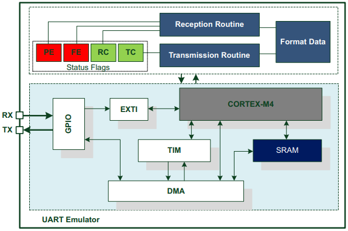
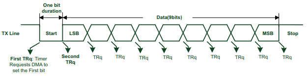
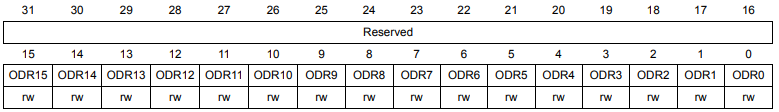
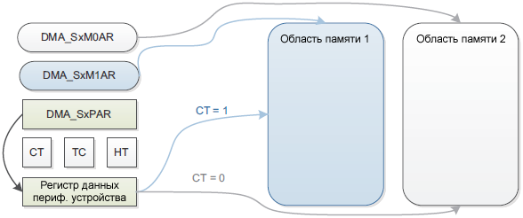

# Программный UART c использованием DMA


* NUCLEO-F401RE
* STM32F401RET6U
* ARM Cortex M4
* CMSIS
* STM32 CubeIDE v1.13.2

>Реализация передачи данных через программный UART используя DMA.

Мы можем передавать данные по UART с помощью GPIO, потому что UART - это протокол асинхронной последовательной связи, который определяет формат и скорость передачи данных. Для реализации UART нам нужно уметь управлять уровнем сигнала на проводе в соответствии с битами данных, старт-битом и стоп-битами. Это можно сделать с помощью GPIO, способными устанавливать или считывать логический уровень на пине. Для того, чтобы GPIO работали как UART, нам также нужно использовать таймер, который будет генерировать запросы DMA с заданной частотой, определяющей скорость передачи.

<p align="center">

</<p align="center">


Разработка программы была разделена на блоки: 

1) Разработа четкого алгоритма ✓

2) Проверить смогу ли я управлять светодиодом с определенным периодом заданным в регистре ARR таймера ✓

3) Реализовать передачу одного символа на терминал ✓
   
4) Реализовать передачу строки в терминал ✓
   
5) Реализовать замену символов передающейся строки с помощью приема символов по UART2  ✓


Алгоритм работы:

**Передача одного кадра** 

1) Первым делом надо настроить порт на выход и с подтяжкой (**PA5**) , чтобы установить высокий уровень , так как мы передатчик.

2) Передача данных из памяти на второе UART устройство выполняется с помощью DMA. Таймер посылает Dma запрос , чтобы установить нашу ножку в нулевое состояние и начать передачу .

3) После этого таймер начинает считать промежуток времени равный определенного нами Baudrate.

4) Когда промежуток времени по передаче одного бита истек , таймер шлет запрос dma установить следующий бит из памяти . 
   
**Многокадровая передача:**

 Многокадровая передача основана на использовании двух буферов. Когда DMA передает половину первого кадра в первый буфер, процессор формирует второй кадр во втором буфере. После передачи каждого кадра DMA должен быть переконфигурирован с новым исходным адресом (адресом первого или второго буфера). Эта операция повторяется до тех пор, пока все кадры не будут переданы. 


<p align="center">

</<p align="center">


```c
#define SIZE 10 // Размер буфера для передачи данных

uint16_t buf[SIZE] = {0x0000, 0x0000, 0x0000, 0x0000, 0x0000, 0x0000, 0x0000, 0x0000, 0x0000, 0x0020}; // первый буфер

uint16_t buf1[SIZE] = {0x0000, 0x0000, 0x0000, 0x0000, 0x0000, 0x0000, 0x0000, 0x0000, 0x0000, 0x0020}; // второй буфер

char a[] = "Hello\n"; // сообщение для передачи
```
Определим индекс, который определяет какой символ сообщения кладем в буфер 
```c
uint8_t i = 1;
```
Определим размер данных, которые будем принимать с UART2 и индекс, чтобы заменять соответствующий символ в передающемся сообщении

```c
#define rx_size (sizeof(a)-1)
uint8_t rx_index = 0; // начнет заменятся с нулевого символа 
```
Инициализация порта
```c
void GPIO_Init(){

		RCC->AHB1ENR |= RCC_AHB1ENR_GPIOAEN; //Тактирование на порт A

		GPIOA->MODER &= ~GPIO_MODER_MODER5; // очистили режим для нужного пина

		GPIOA->MODER |= GPIO_MODER_MODER5_0; // пин на выход

		GPIOA->OSPEEDR |= (GPIO_OSPEEDR_OSPEED5_0 | GPIO_OSPEEDR_OSPEED5_1 ); // скорость very high

		GPIOA->BSRR = GPIO_BSRR_BS5; // установили в высокое состояние (мы передатчик)

		// UART
		GPIOA->MODER |= GPIO_MODER_MODER3_1; //режим альтернативной функции

		GPIOA->AFR[0] |= (GPIO_AFRL_AFRL3_0 | GPIO_AFRL_AFRL3_1 | GPIO_AFRL_AFRL3_2); // Альтернативная функция для приемника


		}
```
Настройка таймера как как измерителя интервалов времени. Запрос к блоку DMA будет происходить во время переполнения — TIM1_UP
```c
void TIM1_Init(void)
{
		RCC->APB2ENR |= RCC_APB2ENR_TIM1EN; // тактирование на таймер

		TIM1->PSC = 0; // Prescaler

		TIM1->ARR = 1667 - 1; // Auto-reload value для 9600 Baud rate

		TIM1->EGR |= TIM_EGR_UG; // Очистили теневые регистры

		TIM1->SR &= ~TIM_SR_UIF; // Очиста вызывает update поэтому очищаем флаг

		TIM1->DIER |= TIM_DIER_UDE; // Включаем запрос DMA по обновлению таймера

}
```
Регистр ODR 32-ух битный, но используется в нём только первые 16 бит, мы будем передавать полслова

<p align="center">

</<p align="center">

```c
void DMA_Init(void){

		RCC->AHB1ENR |= RCC_AHB1ENR_DMA2EN;

		DMA_Stream->CR = (DMA_SxCR_CHSEL_1 | DMA_SxCR_CHSEL_2)  ; // 6 канал 110

		DMA_Stream->CR |= DMA_SxCR_MSIZE_0;// MSIZE 16 bit

		DMA_Stream->CR |= DMA_SxCR_PSIZE_0;// PSIZE 16 bit

		DMA_Stream->CR |= DMA_SxCR_MINC; // инкремент памяти памяти

		DMA_Stream->CR |= DMA_SxCR_DIR_0;  //  сбрасываю 7 бит 01 Из памяти в периф

		DMA_Stream->CR |= DMA_SxCR_PL_1; // Приоритет потока: высокий

		DMA_Stream->CR |= DMA_SxCR_HTIE; // Прерывание по половине

		DMA_Stream->CR |= DMA_SxCR_TCIE; // Прерывание полная передача

		DMA_Stream->CR |= DMA_SxCR_TEIE; // Ошибка передачи (если неверный адрес и тд)

		DMA_Stream->CR |= DMA_SxCR_DBM; //  Режим двойной буферизации.

		NVIC_EnableIRQ(DMA2_Stream5_IRQn); // глоб прерывания для DMA2_Stream5

}
```
## Режим двойной буферизации
В двойной буферизацией есть 2 указателя на память. Когда разрешен режим двойной буферизации, автоматически разрешается кольцевой режим (Circular mode), и на каждом окончании транзакции (когда регистр DMA_SxNDTR достигает 0) указатели на память переключаются. Это позволяет программе работать с одним буфером, пока второй буфер заполняется или используется транзакцией DMA.
* Когда бит CT (Current Target) в регистре DMA_SxCR равен 0, текущий используемый DMA целевой буфер памяти 0, поэтому может быть обновлен адрес DMA буфера памяти 1 (DMA_SxM1AR).
  
* Когда бит CT (Current Target) в регистре DMA_SxCR равен 1, текущий используемый DMA целевой буфер памяти 1, поэтому может быть обновлен адрес DMA буфера памяти 0 (DMA_SxM0AR).
  
<p align="center">

</<p align="center">

```c
void DMA_Config(uint32_t perih_address, uint32_t mem_address , uint32_t mem_address1, uint16_t data_amount ){

		DMA_Stream->NDTR = data_amount;

		DMA_Stream->PAR = perih_address;

		DMA_Stream->M0AR = mem_address; // сначала передаем первый буфер

		DMA_Stream->M1AR = mem_address1; // после передачи первого передаем второй

		DMA_Stream->CR |= DMA_SxCR_EN;
}
```
Инициализация UART2 на прерваание по приему данных
```c
void USART_init() { // включаем USART2 PA3

		RCC->APB1ENR |= RCC_APB1ENR_USART2EN; // Вкл тактирование

		USART2->BRR = 0x683; //Задали частоту работы

		USART2->CR1 |= (USART_CR1_RE | USART_CR1_RXNEIE); // Настроили на чтение

		USART2->CR1 |= USART_CR1_UE; //Вкл USART

		NVIC_EnableIRQ(USART2_IRQn); // глобальные прерывания

}
```

Ф**ункция `main()`**
```c
   int main(void)
{
	USART_init();
	Data_Put(a, buf); // предварительно заполняем первый буфер
	GPIO_Init();
	TIM1_Init();
	DMA_Init();
	DMA_Config( (uint32_t) &GPIOA->ODR , (uint32_t) buf, (uint32_t) buf1, SIZE);

	TIM1->CR1 |= TIM_CR1_CEN; // включаем таймер TIM1

	while(1){

	}
}

```
**Логика передачи кадра**

Определяет переменную mask со значением 0x0020. В двоичной системе счисления как 0000000000100000. Это число будет использоваться как маска для установки бита, то есть для изменения 6го бита в значении (на самом деле для нас 5го так как счет с нуля).

Помещает i-й бит из b в 6-й бит значения i-го элемента массива buf. Это означает, что он копирует один бит из переменной b, которая содержит символ из строки a, в один бит в массиве buf. Для этого он использует операцию побитового сдвига вправо (>>) для получения i-го бита из b, операцию побитового И (&) с единицей для отбрасывания лишних битов, операцию побитового сдвига влево (<<) для перемещения бита на 6-ю позицию, и операцию побитового ИЛИ (|) для объединения битов с предыдущим значением элемента массива. Побитовое ИЛИ возвращает единицу, если хотя бы один из операндов равен единице, поэтому все биты, кроме 6-го, остаются неизменными, а 6-й бит становится равным i-му биту из b.
```c
void Data_Put(char *a , uint16_t *buf){


	uint8_t b = (uint8_t) *a;

	uint16_t mask = 0x0020; // маска для бита

	for(int i = 0; i < 8; i++) // цикл по 8 элементам массива
	{
		  buf[i+1] = buf[i+1] & ~mask; // сбрасываем 6-й бит значения i-го элемента массива
		  buf[i+1] = buf[i+1] | ((b >> i) & 0x01) << 5; // помещаем i-й бит из а в 6-й бит значения i-го элемента массива
	}

}

```


Обработчик прерываний DMA
```C
void DMA2_Stream5_IRQHandler(void){


	if (READ_BIT(DMA2->HISR, DMA_HISR_HTIF5)){ // половина буфера передалось

		if(!(DMA_Stream->CR & DMA_SxCR_CT)) // первый источник памяти
		{
			FillBuf(a,buf1); // передали половину первого буфера , заполнили второй

		}
		else if ((DMA_Stream->CR & DMA_SxCR_CT)) // второй источник памяти
		{
			FillBuf(a,buf); // передали половину второго буфера , заполнили первый

		}

		DMA2->HIFCR |= DMA_HIFCR_CHTIF5; // очистили флаг
	}

	if ((READ_BIT(DMA2->HISR, DMA_HISR_TCIF5))){ // передача по 5 потоку завершена полностью

		DMA2->HIFCR |= DMA_HIFCR_CTCIF5; // очистили флаг

		TIM1->CNT = 0;
		}
	}

```
Функция для заполнения чередующихся буферов
>В первом прервании по передаче DMA начинается заполнение уже второго кадра , так как буфер уже был предварительно заполнен в `main()`, но как только мы дошли до конца сообщения(строки), то мы начинаем заполнение уже первого символа сообщения в буфер передачи
```c

void FillBuf(char* data, uint16_t *buf) // функция для заполнения чередующихся буферов
{
	Data_Put(data + i, buf);
	i++;
	if (i > (strlen(data) - 1)) i = 0;

}
```
В обработчике прервании по UART, мы заменяем символ в передаваемой строке по порядку, но при этом не заменяем строковый литерал `\n` (символ новой строки). В данной логике мы не превышаем размер исходного сообщения , то есть данные будут перезаписываться с начала, если мы превысим размер.
```c
void USART2_IRQHandler (void)
{
	 if (USART2->SR & USART_SR_RXNE)
	 {

		 a[rx_index++] = (char) USART2->DR; // заменяем символ в передаваемой строке по порядку

		 if(rx_index == rx_size-1) rx_index = 0; // если дошли до конца строки то переходим вначало
	 }
 }
```


## Сборка проекта
Собрать программу можно с помощью утилиты `make` для этого надо иметь `GNU Arm Embedded Toolchain` 

Если вы используете **STM32CubeIDE** с дефолтным расположением на диске C при установке, то вы можете прописать в системной переменной среды `Path` следующую команду 

`C:\ST\STM32CubeIDE_1.13.2\STM32CubeIDE\plugins\com.st.stm32cube.ide.mcu.externaltools.gnu-tools-for-stm32.11.3.rel1.win32_1.1.1.202309131626\tools\bin`

Также понадобится минимальный набор утилит для процессинга **Make** файлов , он также расположен в:

`C:\ST\STM32CubeIDE_1.13.2\STM32CubeIDE\plugins\com.st.stm32cube.ide.mcu.externaltools.make.win32_2.1.0.202305091550\tools\bin`

Открываем консоль `cmd` в папке склонированного репозитория и вводим следующие команды

```c
cd Debug
make all
```
На выходе вы получаете файл с расширением `.hex` в папке Debug

Для запуска программы понадобиться `STM32 ST-LINK Utility.exе` c помощью которой вы сможете зашить **.hex** файл в МК

Если вы используете **STM32 CubeIDE v1.13.2** то вы можете также добавить свой проект в свой WORKSPACE кликнув на файл `.project`
